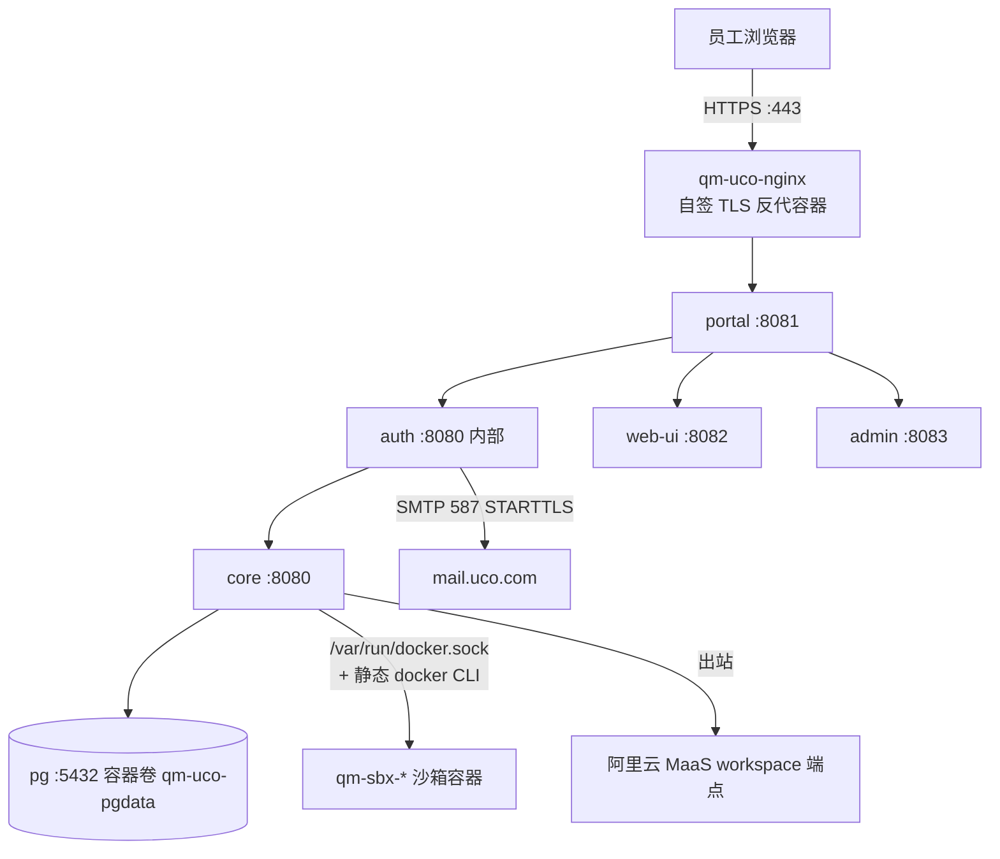

# QM ai-agent 内网服务器部署实录（docker target）

> 部署日期：2026-08-06。服务器：ai-agent 10.2.66.124（Ubuntu 22.04，4C/7.5G/46G，无 KVM）。
> 仓库：本 fork master（部署时 HEAD d4b2f82）。与 [deployment-summary.md](./deployment-summary.md)（shuilx/腾讯云）是两台独立部署。

## 0. 现状一览

| 项 | 值 |
|---|---|
| Stack 名 | `uco`（容器前缀 `qm-uco-*`） |
| 部署目录 | 服务器 `~/qm`（git clone 关系：经 git bundle 与 origin/master 对齐） |
| 入口 | `https://qm.test.uco.com`（nginx 容器自签证书，443→portal 8081；80 跳转 443） |
| 登录 | 内置 auth broker + 公司 SMTP（mail.uco.com:587 STARTTLS）一次性链接 |
| 邮箱准入 | `AUTH_ALLOWED_EMAIL_DOMAIN=uco.com`（单域，配置即生效于 auth+portal 两侧） |
| 管理员 | `ADMIN_GRANTS=leoneni@uco.com:org_admin,fuchaojian@uco.com:org_admin` |
| 模型 | 阿里云 MaaS workspace（`ALIYUN_BASE_URL` 指向 workspace 端点），base model `qwen3.7-max`（config 顶层 `model` 注入 `PI_MODEL`） |
| 沙箱 | `SANDBOX_BACKEND=local`，镜像 `qm-sandbox-local:latest`，容器 `qm-sbx-*` 动态创建 |

## 1. 架构



## 2. 服务器环境（均为增量，未动既有服务）

- **Node 24**：`~/node24`（home 目录 tarball 安装，未写系统路径；使用时 `export PATH=$HOME/node24/bin:$PATH`）。
- **docker registry mirror**：`/etc/docker/daemon.json` 仅含 `registry-mirrors`（daocloud/1ms/xuanyuan），因 docker.io 直连被断。不影响容器 env。
- **dockerd 拉取代理**：`/etc/systemd/system/docker.service.d/proxy.conf`（HTTP(S)_PROXY=127.0.0.1:7897）。仅影响 daemon 拉镜像，不注入容器。**拉不到镜像时**：本地起 `ssh -N -R 7897:127.0.0.1:7897 leoneni@10.2.66.124`（需本地 7897 有代理），或本地 `docker pull --platform linux/amd64 && docker save --platform linux/amd64 | ssh ... 'sudo docker load'`。
- **静态 docker CLI**：`deploy/layers/uco/bin/docker`（27.5.1，必须存在，core 容器挂载它操作宿主 docker；缺它会挂 glibc 动态版进 alpine 报 exec error）。验证：`docker exec qm-uco-core docker version` 出双版本。
- 既有服务（zabbix:10050、hermes:9119、sshd:22）全程未受影响；docker 重启时无任何容器在跑。

## 3. 配置（`~/qm/deploy/layers/uco/`）

- `qm.config.jsonc` 已提交进 fork master。要点：`target:docker`、`modelProvider:aliyun`、`model:qwen3.7-max`、`HARNESS=pi`、`SANDBOX_BACKEND=local`、`ALIYUN_BASE_URL`、auth smtp + `AUTH_ALLOWED_EMAIL_DOMAIN=uco.com`。
- `.env`（600，gitignored，不入库）：`ALIYUN_API_KEY`、`SMTP_*`、`AUTH_EMAIL_FROM`、`ADMIN_GRANTS`、`PUBLIC_API_URL=http://host.docker.internal:8080`、8 个铸造密钥（CORE_SIGNING/CAPABILITY/PORTAL_IDENTITY/CONNECTOR/SKILL_SIGNING/PORTAL_SESSION/AUTH_TOKEN/AUTH_CLIENT + AUTH_SIGNING_JWK）。
- **模型注意**：workspace 拒绝内置默认模板 `qwen3.8-max-preview`（access_denied），故显式 `model:qwen3.7-max`。workspace 模型清单可用 `/models` 查询；换模型改 config 的 `model` 字段即可。

## 4. 运维

```bash
export PATH=$HOME/node24/bin:$PATH; cd ~/qm
node cli/bin/qm.ts status --config deploy/layers/uco/qm.config.jsonc
node cli/bin/qm.ts logs core --config deploy/layers/uco/qm.config.jsonc
docker logs qm-uco-auth --tail 20          # SMTP 发信记录
docker ps | grep sbx                        # 沙箱容器
# 更新代码：本地推 master 后 git bundle | ssh fetch+reset，再
node cli/bin/qm.ts up --build-from --config deploy/layers/uco/qm.config.jsonc
```

## 5. 验收结果（2026-08-06 全绿）

- `curl http://127.0.0.1:8080/healthz` → ok；portal 401 登录门禁；nginx 443→401、80→301。
- SMTP：curl 登录链 → auth 日志 `sign-in link sent to leoneni@uco.com (OK)`；`leoneni@thelian.com` 被拒（`sign-in link suppressed`，未发信）。
- 真实 turn（双管理员各一次，签名 curl）：runs 表 status=done，阿里云模型真实回复；沙箱卷 `qm-home-personal-*` 内宿主机读回 UUID 一致（证明 local sandbox 真实执行）。
- `qm check` / `qm conformance` 全 pass（conformance 的 layer-resolved 需先 PUT 一次空 layer bundle 落 durable store，已执行）。
- 容器全部 `--restart unless-stopped`。

## 6. 遗留事项

- [ ] **LB 转发**：内网 DNS `qm.test.uco.com` → 10.2.1.81（公司 LB），需 LB 侧配 443→10.2.66.124:443（或 LB 终结 TLS 后 HTTP→10.2.66.124:8081）。当前自签证书在部署机 nginx；若 LB 用正式证书终结，可停用本机 nginx。服务器自身 `https://10.2.66.124:443` 已可达。
- [ ] **audit 门禁**：`deploy/core/Dockerfile` 临时 `--audit-level=critical`（pi-coding-agent tgz 内 shrinkwrap vendored undici 8.5.0 / brace-expansion 5.0.8，2 high + 1 moderate，overrides 够不到）。上游 issue 已提（构建失败+请求重打安全 artifact）；上游修复落地后恢复 moderate 并重新构建。
- [ ] 自签证书 → 正式证书（若不走 LB 终结）。
- [ ] 8080-8083 目前 0.0.0.0 暴露，网络安全组/EDR 策略收敛后只留 443。
- [ ] `PORTAL_IDENTITY_SECRET unset — dev fallback`（auth 容器 chassis 警告）：与 shuilx 部署行为一致，功能验证无影响，待 upstream 明确 auth 是否需要该密钥。

## 7. 与 shuilx 部署的差异

- 域名+证书：shuilx 用公网 IP:8096 自签；本部署用内网域名 qm.test.uco.com + 443 自签 nginx 容器（Caddy/nginx 均不改宿主机，nginx 直接容器化）。
- 邮件：QQ 个人授权码 → 公司 SMTP mail.uco.com:587 STARTTLS（`*.uco.com` 正式证书，TLS 校验通过）。
- 模型：MiniMax → 阿里云 workspace（`ALIYUN_BASE_URL` override 首次实战）。
- npm：服务器 npm 需单独修复（node tarball 内 minipass 嵌套损坏，用 registry tgz 重装 npm 解决）。
