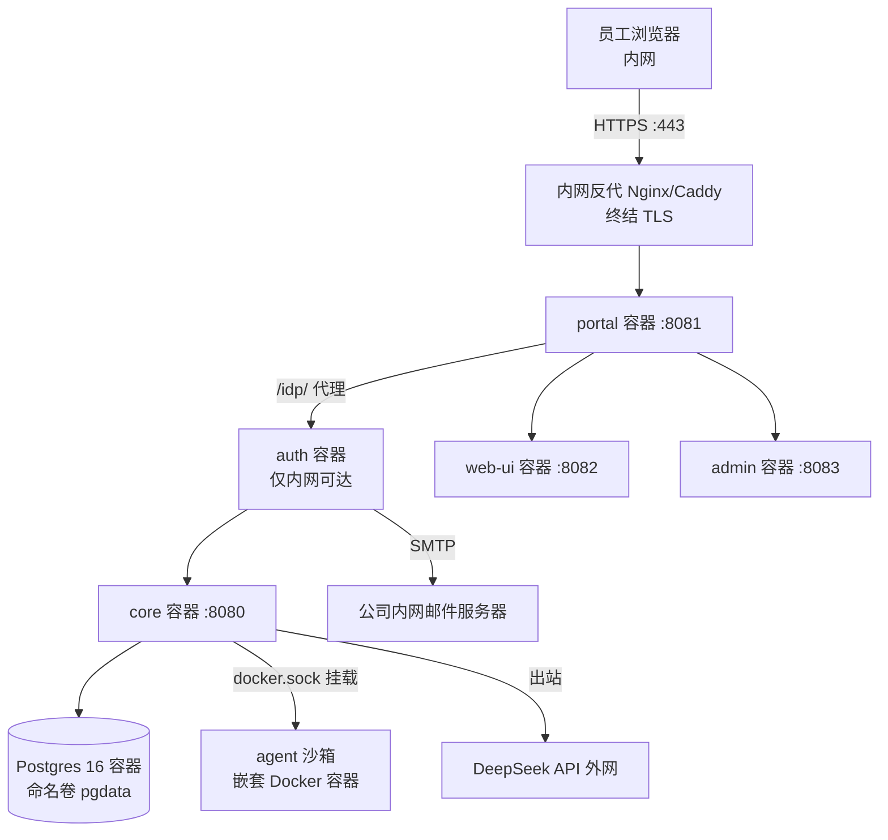

# QM 内网 VPS 部署方案（docker target）

> 文档性质：部署方案 + 调研结论。尚未执行部署。
> 组织 slug 暂定为 `uco`（邮箱域 uco.com / thelian.com），部署时可整体改名 `deploy/layers/uco/`。
> 决策日期：2026-08-06。适用仓库：本 fork（origin: LeoneNee/qm，upstream: yc-software/qm）。

## 0. 决策记录

| 项 | 决策 | 备选（未采纳） |
|---|---|---|
| 部署目标 | `docker`（单机 VPS 全栈容器） | Fly.io / AWS（非内网） |
| 沙箱后端 | `SANDBOX_BACKEND=local`（嵌套 Docker） | 加固方案见 §6，走 upstream |
| 模型提供商 | `deepseek`（base model `deepseek-v4-flash`） | OpenAI / Anthropic / 其他 CN 厂商 |
| Harness | `pi`（deepseek 只支持 pi/mock） | — |
| 登录 | 内置 `auth` broker + 内网 SMTP 一次性链接 | Slack OIDC / 外部 OIDC |
| 邮箱准入 | `AUTH_ALLOWED_EMAILS` 命名清单（双域名单值限制，见 §3.3） | 单 `AUTH_ALLOWED_EMAIL_DOMAIN` |
| TLS | 内网反代终结 HTTPS（部署前置，非可选项） | — |

## 1. 部署形态



- 全部组件单机容器化，`--restart unless-stopped`，数据在命名卷（`pgdata`、`coredata`）。
- 端口（`QM_BASE_PORT` 默认 8080，可整体平移）：core=8080，portal=8081，web-ui=8082，admin=8083。**反代监听 443 转发至 portal:8081；portal 是唯一由反代暴露的入口**；auth 只有网络别名 `auth.internal`，不映射宿主机端口。
- 持久化：`SESSION_STORE=postgres`、`RUN_STORE=postgres`（docker backend 自动注入，见 `cli/src/backends/docker.ts`）。
- **生产要求 HTTPS**：`publicUrl` 为 https 时 Portal 才签发 Secure cookie（非 https 会有 "dev/test only" 警告），Auth 的 OIDC issuer/redirect 也全部从 `publicUrl` 派生。

## 2. 前置条件

| 项 | 要求 | 验证命令 |
|---|---|---|
| Node | **24+**（根 package.json 要求；本机当前 v22 不达标） | `node -v` |
| npm | 11+ | `npm -v` |
| Docker | 含 Buildx，daemon 运行中 | `docker info` |
| openssl | 生成密钥 | `openssl version` |
| Git | — | `git --version` |
| **内网域名 + TLS** | 内网 DNS 解析到 VPS；证书由内网 CA 签发（员工浏览器须信任该 CA），反代用 Nginx 或 Caddy | `curl -vk https://<内网域名>` |
| 镜像来源 | 能拉发布镜像，或 `--build-from` 本地构建 | — |
| KVM（可选，§6 加固用） | `ls /dev/kvm` 存在 | `ls /dev/kvm && lscpu \| grep Virtualization` |

CLI 命令全程在 **repo 根目录**执行，用 `--config` 指向 layer（fork 原生流程，见 `deploy/layers/README.md`），不依赖 layer 内 `npm exec qm`（内网若无 npm registry 也不受影响）。

## 3. 配置决策

### 3.1 模型

- `modelProvider: "deepseek"` → `qm setup` 收 `DEEPSEEK_API_KEY`，base model 自动为 `deepseek-v4-flash`。
- `env.core.HARNESS = "pi"`。docker target 默认 harness 是 `mock`（罐头回复、不调模型），**必须显式设为 pi**（`cli/src/config.ts` `configuredHarness`）。
- 若改 OpenAI：`modelProvider: "openai"`，`OPENAI_API_KEY`，base model `gpt-5.6-sol`。

### 3.2 登录（内置 auth broker + 内网 SMTP）

| 配置 | 值 |
|---|---|
| `env.auth.AUTH_EMAIL_TRANSPORT` | `smtp` |
| `SMTP_HOST` / `SMTP_USERNAME` / `SMTP_PASSWORD` | 公司内网邮件服务器（`.env` 密钥） |
| `SMTP_PORT` | 默认 587；465 自动 implicit TLS；`SMTP_TLS=none` 生产被拒 |
| `AUTH_EMAIL_FROM` | 内网发件地址 |
| `env.auth.AUTH_BRAND_NAME` | 公司名 |

### 3.3 双邮箱域名（uco.com + thelian.com）

`AUTH_ALLOWED_EMAIL_DOMAIN` 是单值。双域名的两个选项：

1. **`AUTH_ALLOWED_EMAILS`** 命名清单（`.env`，逗号分隔；`qm setup` 会从 `ADMIN_GRANTS` 派生管理员地址）——小团队可行；
2. 或选定一个主域名用 `AUTH_ALLOWED_EMAIL_DOMAIN`，另一域名用户逐个加入命名清单。

注意 Auth 与 Portal 两侧白名单必须一致，不一致会出现"邮件发出但 Portal 拒绝"。

### 3.4 qm.config.jsonc 草稿

`qm init` 的 docker 骨架默认只含 `core,web-ui` 且写入 `sandbox.app`（Fly 沙箱）。本方案**删除 `sandbox` 块**，改为：

```jsonc
{
  "contract": 1,
  "orgId": "uco",
  "publicUrl": "https://<内网域名>",          // 例 https://qm.uco.com，反代终结 TLS 后转 portal:8081
  "target": "docker",
  "modelProvider": "deepseek",
  "services": ["core", "web-ui", "admin", "portal", "auth"],
  "env": {
    "core": {
      "HARNESS": "pi",
      "SANDBOX_BACKEND": "local",
      "LOCAL_SANDBOX_IMAGE": "qm-sandbox-local:latest"
    },
    "auth": {
      "AUTH_EMAIL_TRANSPORT": "smtp",
      "AUTH_BRAND_NAME": "<公司名>"
    }
  }
}
```

`sandbox.app` 与 `SANDBOX_BACKEND=local` 互斥依赖工作区的 `cli/src/commands/check.ts` 改动（见 §7）。

### 3.5 .env 密钥清单

`.env` 权限 600、gitignored，永不提交。`qm setup` 会逐项收集：

- `DEEPSEEK_API_KEY`（模型，必需）
- `SMTP_HOST` / `SMTP_USERNAME` / `SMTP_PASSWORD`（内网邮件）
- `AUTH_ALLOWED_EMAILS`（双域名命名清单）
- `ADMIN_GRANTS=<admin邮箱>:org_admin`（管理员种子，小写）
- broker 签名密钥、portal client 凭据由 CLI 自动生成，禁止手填

## 4. 部署步骤（全部在 repo 根目录执行）

```bash
# 0. 先就绪内网 TLS 反代（§2）：内网域名指向 VPS，反代监听 443 → 127.0.0.1:8081

# 1. 初始化 layer
node cli/bin/qm.ts init deploy/layers/uco --org uco --target docker --model-provider deepseek

# 2. 按 §3.4 修正 deploy/layers/uco/qm.config.jsonc（补 services、删 sandbox 块、加 env）

# 3. 校验 .env 私密性
chmod 600 deploy/layers/uco/.env
git check-ignore --quiet deploy/layers/uco/.env

# 4. 密钥向导（模型 key + SMTP + 管理员）
node cli/bin/qm.ts setup --config deploy/layers/uco/qm.config.jsonc

# 5. 构建 agent 沙箱镜像（repo 根目录，产出 qm-sandbox-local:latest）
npm run sandbox:local:build

# 6. 启动（内网拉不到镜像时加 --build-from）
node cli/bin/qm.ts up --config deploy/layers/uco/qm.config.jsonc

# 7. 验证
node cli/bin/qm.ts check --live --config deploy/layers/uco/qm.config.jsonc
node cli/bin/qm.ts conformance --config deploy/layers/uco/qm.config.jsonc
node cli/bin/qm.ts outputs --json --config deploy/layers/uco/qm.config.jsonc
```

## 5. 验收清单

- [ ] `https://<内网域名>` 可访问，浏览器证书无警告（内网 CA 信任链就绪）
- [ ] `check --live` 全绿
- [ ] 管理员通过内网邮箱一次性链接登录（验证 SMTP 链路）
- [ ] Web UI 发消息收到**真实模型回复**（确认 HARNESS=pi、DEEPSEEK_API_KEY 有效）
- [ ] 让 agent 在 `/root/workspace/qm-computer-proof.txt` 写一个 UUID，容器外独立验证该文件存在（证明沙箱真实执行）
- [ ] 双域名（uco.com / thelian.com）用户各登录一次
- [ ] `qm up` 幂等重跑无漂移
- [ ] 机器重启后容器自动恢复（`unless-stopped`）

## 6. 调研结果（核心）

### 6.1 沙箱现状：唯一生产缺口

控制面（core/portal/auth/web-ui/admin/Postgres）单机 docker target 即可生产运行；**agent 沙箱是唯一未被支持为生产的能力**：

- 生产模式（`NODE_ENV=production`）`SANDBOX_BACKEND` 必须显式为 `sprites`（Fly）/ `aws`（Lambda MicroVM）/ `local`（`src/config.ts:593`）
- `local` 自报 dev-only（`src/sandbox/local-sandbox.ts:324`），`egressEnforcement: "none"`
- 注入 `HTTP(S)_PROXY` **不是** egress enforcement：agent 可用原始 socket 或清掉环境变量绕过。真 enforcement 需要宿主机/网络层 deny-by-default，只放行代理

### 6.2 阿里云 agent 沙箱调研（2026-08）

| 产品 | 类型 | 对本方案的意义 |
|---|---|---|
| AgentRun（函数计算 FC 云沙箱） | 公有云托管，MicroVM（神龙+RunD），Code Interpreter / Browser / All-In-One 三类，SDK 已开源 | 沙箱数据出内网，与"全内网"冲突；若放宽为"控制面内网+沙箱上云"可用 |
| ACS Agent Sandbox（容器计算服务） | 公有云托管，MicroVM 级隔离 | 同上 |
| **OpenSandbox**（开源，Apache 2.0，2026-03 发布，12.3k★） | **可自托管**，Docker/K8s runtime，统一沙箱协议，TS SDK | 唯一适配"全内网 on-prem 沙箱 substrate"的候选 |

### 6.3 OpenSandbox 深度评估

**隔离（secure-container.md 兼容性矩阵）：**

| runtime | 隔离 | iptables nat 表 | 单 VPS 可用性 |
|---|---|---|---|
| runc（默认） | 进程级 cgroups | ✅ | ✅ 但与现有 local 后端同级 |
| gVisor (runsc) | syscall 拦截 | **❌ 不实现 nat 表** | 需装 runsc + 配 daemon.json + `[secure_runtime]` |
| Kata (QEMU) | VM 级完整内核 | ✅ | **需 KVM**（`ls /dev/kvm`） |
| Kata (Firecracker) | MicroVM | ✅ | 仅 K8s 模式，单机不可行 |

**关键互斥（已核实，此前结论已更正）：** gVisor netstack 不实现 iptables `nat` 表，egress sidecar 依赖 nat REDIRECT 拦截 DNS，二者**不可同用**；server 请求期校验，`gvisor + network_policy` 直接 **HTTP 400**（上游限制 gvisor#170）。Docker 单机模式下 Cilium `toFQDNs` 解法不适用。

**Egress sidecar（components/egress）：** `dns+nft` 模式 = iptables 重定向 53 → DNS 过滤代理 + nftables default-deny，放行域名解析 IP 进动态 allow set（TTL 60–360s，活动 TCP 续期）；装不上 redirect 则 sidecar 退出（fail-closed）。Docker 模式单机可跑（sidecar 需 `CAP_NET_ADMIN`，app 容器共享其 netns）。这正是 6.1 缺的网络层 deny-by-default。

**与 QM `Sandbox` 接口能力映射（src/sandbox/sandbox.ts）：**

| QM 需要 | OpenSandbox | 状态 |
|---|---|---|
| provision（image/env/资源限制） | POST /sandboxes | ✅ |
| run + 超时 | /command（cwd/envs/uid/gid/timeout，SSE） | ✅ |
| 文件读写/listDir/removeDir | Filesystem 全套 CRUD | ✅ |
| startProcess / readProcess（增量） | /command background + /command/{id}/logs cursor + status | ✅ |
| listProcesses | per-id status | ⚠️ 需拼 |
| signalProcess | 仅 interrupt（terminate） | ⚠️ 无任意信号 |
| **writeStdin** | **无** | ❌ 真实缺口（execd 需补，Go，可贡献回上游） |
| backupComputer | Filesystem + snapshot | ✅ |
| teardown keepWarm / destroy | pause/resume + snapshot/delete | ✅ |
| reapDeepIdle | timeout + pause | ✅ |
| resident_disk 持久卷 | 各 runtime 均支持 Docker Volume | ✅ |
| egress enforcement | sidecar dns+nft fail-closed | ✅（runc/Kata 下） |

### 6.4 结论

- **VPS 有 KVM**：OpenSandbox（Kata-QEMU + egress sidecar）在隔离和 egress 两轴均严格优于现有 local 后端，是真正的生产级 on-prem substrate。
- **VPS 无 KVM**：OpenSandbox（runc + egress sidecar）隔离与 local 同级，但补上 fail-closed egress、pause/resume/snapshot 生命周期、统一协议，仍是净收益。
- **gVisor 单用**（放弃 egress）不适合 QM——QM 的生产缺口恰是 egress。
- 无论哪条组合，QM 侧都要新写一个 sandbox backend 适配器（core 改动 → upstream-pr）；execd 侧需补 writeStdin/任意信号。

## 7. fork 边界与当前工作区未提交改动

本 fork 规则：core 与 upstream 字节一致，org 内容只放 `deploy/layers/<org>/`，core 通用改动走 upstream-pr。

当前工作区有以下**未提交 core 改动**，本方案 §3.4/§4 依赖其中前两项：

| 文件 | 改动 | 归属 |
|---|---|---|
| `cli/src/backends/docker.ts` | `SANDBOX_BACKEND=local` 时给 core 挂 docker.sock/docker 二进制、`auth.internal` 网络别名 | 通用能力 → upstream-pr |
| `cli/src/commands/check.ts` | local 沙箱时不再强制 `sandbox.app` | 通用能力 → upstream-pr |
| `plugins/auth/src/smtp.ts` | 删除 AUTH PLAIN（内网 SMTP 兼容） | 通用能力 → upstream-pr |
| `deploy/core/Dockerfile` | 放宽 npm audit（离线构建容错） | 通用能力 → upstream-pr |
| `WATCHDOG.yml` | 模型指向 openai-codex/gpt-5.6-sol | org 偏好，不随 upstream |

部署前需决定：这些改动是提交进 fork（破例）还是先发 upstream 再 `update-qm` 同步。推荐后者。

## 8. 后续工作清单

1. [ ] VPS 装 Node 24+、Docker+Buildx；确认 `ls /dev/kvm`（决定 §6.4 组合）
2. [ ] 内网域名 + 内网 CA 证书 + 反代（443→8081）就绪（§4 步骤 0）
3. [ ] 决定未提交 core 改动的归属（upstream-pr vs fork 提交）
4. [ ] 收集：DeepSeek API key、内网 SMTP 凭据、管理员邮箱、双域名用户清单
5. [ ] 执行 §4 部署步骤 + §5 验收
6. [ ] upstream：on-prem 沙箱加固（QM backend adapter + execd writeStdin 补丁；或 OpenSandbox 适配立项）
