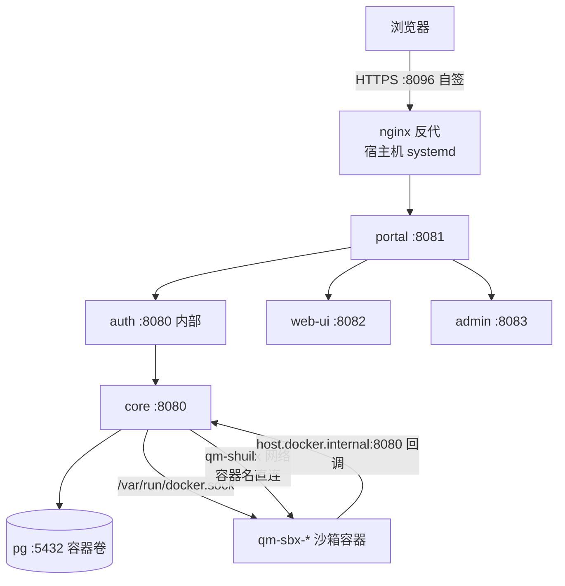

# QM VPS 部署实录（docker target + local sandbox）

> 文档性质：首次部署的实战总结 + 运维手册。配合 [deployment-plan.md](./deployment-plan.md)（方案）阅读。
> 部署日期：2026-08-06。仓库：本 fork（origin: LeoneNee/qm，upstream: yc-software/qm）。

## 0. 现状一览

| 项 | 值 |
|---|---|
| VPS | 腾讯云 Ubuntu（公网 IP 见 `.env`/SSH 配置），密钥 `~/Downloads/tcNJ.pem` |
| Stack 名 | `shuilx`（容器前缀 `qm-shuilx-*`） |
| 部署目录 | VPS `~/qm`（repo 副本 + `.env` + `qm.config.jsonc` + `bin/docker`） |
| 入口 | `https://<VPS_IP>:8096`（nginx 反代 → portal 8081，自签证书） |
| 登录 | 内置 auth broker + QQ 邮箱 SMTP 一次性链接（管理员邮箱见 `.env` `ADMIN_GRANTS`） |
| 模型 | MiniMax（key 已验证可用） |
| 沙箱 | `SANDBOX_BACKEND=local`，镜像 `shuilx-sandbox:local`，容器 `qm-sbx-*` 动态创建 |

## 1. 最终架构（与方案差异）



与方案的三处偏差：

1. **Caddy 换 nginx**。Caddy 在 systemd 下反复失败（`ProtectSystem=full` 挡证书写入、admin 配置加载竞争、internal CA 初始化不稳），改用 nginx 手写 server block 一把通过。教训：此环境直接用 nginx，别再试 Caddy。
2. **公网端口 8096**。腾讯云安全组只放行 8096（8443/443 未放行）。安全组变更需在控制台操作，CLI 不可达——**端口规划要早于部署**。
3. **TLS 为自签证书**。浏览器需手动接受。如需正式证书，先有域名 + 安全组放 443，再换 Let's Encrypt。

## 2. 关键配置（VPS `~/qm`）

### .env 要点

```bash
PUBLIC_API_URL=http://host.docker.internal:8080   # 必须！沙箱容器在独立网络，core 别名不可达
SMTP_HOST=smtp.qq.com
SMTP_PORT=465
SMTP_TLS=implicit
SMTP_USERNAME=<邮箱>
SMTP_PASSWORD=<QQ 授权码，非登录密码>
AUTH_ALLOWED_EMAILS=<逗号分隔准入名单>
ADMIN_GRANTS=<管理员邮箱>
```

### qm.config.jsonc 要点

```jsonc
env: {
  core: {
    SANDBOX_BACKEND: "local",
    LOCAL_SANDBOX_IMAGE: "shuilx-sandbox:local",
  }
}
```

`LOCAL_SANDBOX_DOCKER_BIN`、`LOCAL_SANDBOX_PEER_NETWORK` 由 CLI 注入，不用手写。

### ~/qm/bin/docker（关键文件）

静态链接的 docker CLI（27.5.1），从 `https://download.docker.com/linux/static/stable/x86_64/docker-27.5.1.tgz` 提取。**不能删**——core 容器挂载它操作宿主 docker。VPS 网络下载大文件会被重置，需在本地下载后 scp 上传。

## 3. 踩坑清单（按发现顺序）

### 3.1 VPS 网络

- **npm/docker pull 慢**：需代理。方案：本地 `ssh -R 7897:127.0.0.1:7897` 反向隧道 + VPS `daemon.json` proxies。**构建完成后必须删掉 proxies 段并 `systemctl restart docker`**，否则代理 env 注入所有新容器（含沙箱），沙箱内 `127.0.0.1:7897` 是死地址。
- **大文件直连被重置**（docker static tgz）：本地下载 + scp。
- **隧道会断**：`curl -x http://127.0.0.1:7897` 验证还活着再用。

### 3.2 core 容器内 docker CLI 无法执行（glibc vs musl）

现象：agent 报 "sandbox backend down (Docker isn't running)"，core 日志静默。
根因：挂载宿主 `/usr/bin/docker`（glibc 动态链接）进 alpine(musl) core 容器 → `exec: no such file or directory`。
修复（已提交 master + 静态二进制兜底）：CLI 挂载优先用 `<configDir>/bin/docker`（静态编译，任意发行版容器可执行）。
验证：`docker exec qm-shuilx-core docker version` 出 client+server 双版本。

### 3.3 local-sandbox 的 127.0.0.1 假设（upstream PR #243）

现象：沙箱容器起来了，但 agent 所有 write/exec 返回 `fetch failed`。
根因：`local-sandbox.ts` 写死 `http://127.0.0.1:<port>` 访问沙箱 daemon——core 在容器里时，loopback 是 core 容器自己。
修复：`LOCAL_SANDBOX_PEER_NETWORK=qm-shuilx`（CLI 自动注入），沙箱容器 `docker network connect` 进 stack 网络，core 用容器名直连。daemon 无鉴权，**只允许接内网 stack 网络**。

### 3.4 QQ SMTP 拒绝 AUTH PLAIN（upstream PR #242）

现象：`535 Login fail. Account is abnormal`，凭据明明正确。
根因：QQ 宣传 `AUTH PLAIN` 但拒绝其格式；`AUTH LOGIN` 正常。
修复：auth 插件改 LOGIN 优先（PLAIN 兜底）。
验证：openssl 手测——`openssl s_client -connect smtp.qq.com:465 -quiet` 后 `AUTH LOGIN` + base64 凭据应回 `235`。

### 3.5 .env 粘连

现象：容器内 `SMTP_USERNAME` 值变成 `邮箱+PORTAL_SESSION_SECRET=xxx`。
根因：自写的 .env 生成脚本 `set()` 在键已存在时走错分支，两键并一行。
教训：改 `.env` 用 `sed -i 's|^KEY=.*|KEY=val|'` 精确替换；改完 `grep -n '=' .env | cat -A` 检查粘连/脏字节；docker 读 .env **不 trim**，尾部空格/CRLF 都是脏凭据。

### 3.6 PUBLIC_API_URL

沙箱容器在独立网络 `qm-net-<slug>`，唯一回程是 `--add-host=host.docker.internal:host-gateway`。
`http://core:8080` 在沙箱内不可解析，必须为 `http://host.docker.internal:8080`（core 8080 已发布到宿主）。

### 3.7 验证手段的坑

- **turn 需双重签名**：`x-timestamp`+`x-signature`（HMAC-SHA256，payload `v0:{ts}:{METHOD}\n{path}\n{body}`，密钥 `CORE_SIGNING_SECRET`）+ `x-portal-identity`（jose CompactSign，HS256，`PORTAL_IDENTITY_SECRET`，payload `{p: 邮箱, n: 名, exp}`，kid 为 secret SHA256 base64url 前 8 字符）。
- **curl 模拟登录必须带 `Origin` 头**，否则 auth broker 回 403 `cross-origin request refused`。
- **浏览器自动化工具在本环境不稳**；SMTP 验证用 curl 链（GET /auth/login → 抠 `request` token → POST /idp/authorize）两分钟闭环。

## 4. 运维手册

### SSH

```bash
ssh -i ~/Downloads/tcNJ.pem ubuntu@<VPS_IP>
```

### 部署/更新代码

```bash
# 本地改代码后：
cd cli && npm run build                 # 改了 cli 才需要
scp -i ~/Downloads/tcNJ.pem <改动文件> ubuntu@<VPS_IP>:/tmp/
ssh -i ~/Downloads/tcNJ.pem ubuntu@<VPS_IP> 'cp /tmp/<文件> ~/qm/<对应路径> && cd ~/qm && nohup node cli/dist/bin/qm.js up --build-from > ~/qm-up.log 2>&1 &'
# core 镜像重建只需 COPY src 层，约 2-4 分钟；npm/apk 层有缓存
```

### 状态与日志

```bash
sudo docker ps --format '{{.Names}} {{.Status}}'
sudo docker logs qm-shuilx-core --tail 50
sudo docker logs qm-shuilx-auth --tail 20    # SMTP 发信记录
node cli/dist/bin/qm.js status               # 在 ~/qm 下
```

### run 状态直查（core 日志静默时的排障手段）

```bash
sudo docker exec qm-shuilx-pg psql -U postgres -d qm -c \
  "select id, status, substring(result,1,300) from runs order by created_at desc limit 3;"
sudo docker exec qm-shuilx-pg psql -U postgres -d qm -At -c \
  "select payload->>'result' from run_activity where run_id='<runId>' and type='tool_result';"
```

### 沙箱排障

```bash
sudo docker ps -a | grep sbx                          # 沙箱容器
sudo docker logs qm-sbx-<name>                        # 应见 "exec daemon listening on 8080"
sudo docker exec qm-shuilx-core docker version        # core 内 docker CLI 可用性
# 沙箱 home 在命名卷 qm-home-<scope>，容器 park 后文件仍在：
sudo cat /var/lib/docker/volumes/qm-home-<scope>/_data/workspace/<file>
```

## 5. 部署后验证清单（照做即可）

1. `curl -sk https://<VPS_IP>:8096/` → 401（portal 登录门禁）
2. `curl -s http://127.0.0.1:8080/healthz`（VPS 上）→ `{"ok":true}`
3. SMTP：走 §3.7 curl 登录链 → auth 日志 `sign-in link sent to <邮箱> (OK)`
4. 真实 turn：发 UUID 写入请求 → `runs` 表 status=done → 宿主读沙箱卷内文件比对 UUID（§4 命令）
5. `node cli/dist/bin/qm.js check` → `✓ check passed`（含 SMTP credentials accepted）

## 6. 遗留事项

- [ ] TLS 正式证书（需域名 + 安全组 443）
- [ ] `check --live` docker target 未实现（upstream 仅 fly/aws），live 验证靠 §5 手工清单
- [ ] 安全组端口收敛：8080-8083 不应公网可达，仅 8096
- [ ] fork 的 docker backend local-sandbox 支持（docker.ts/check.ts）未来可整理后提 upstream
- [ ] VPS `~/qm` 与 git master 是 scp 同步关系，非 clone——长期建议改为 clone + pull 部署

## 7. 相关 upstream PR

- [yc-software/qm#242](https://github.com/yc-software/qm/pull/242) — auth: AUTH LOGIN 优先（QQ 兼容性）
- [yc-software/qm#243](https://github.com/yc-software/qm/pull/243) — local-sandbox: peer network 支持
